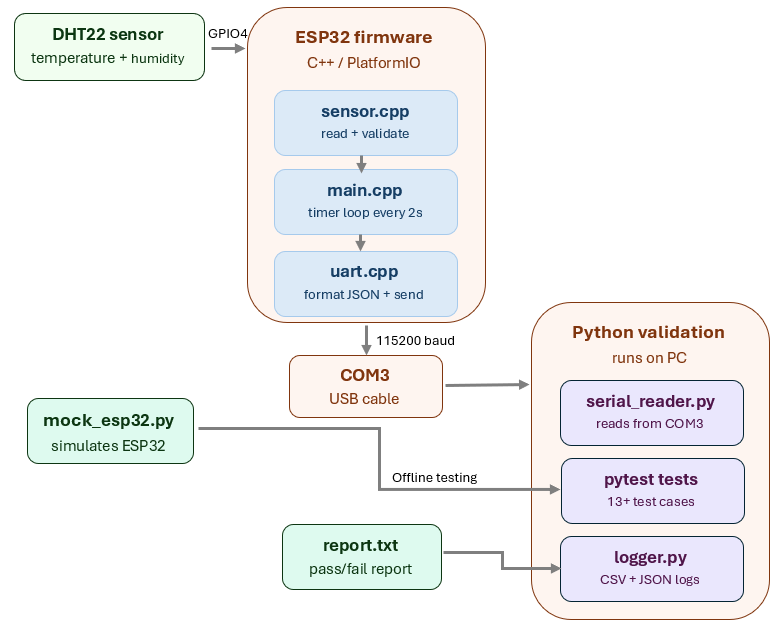

# ESP32 Sensor Validation System

## 📋 Overview
This project implements an end-to-end embedded sensor validation system for environmental monitoring and firmware testing.

The system is built around an ESP32 microcontroller that reads real-time temperature and humidity data from a DHT22 sensor and transmits the readings over UART in JSON format.

A Python based automated validation framework receives the data, validates, logs the results and generates test reports.

The project also includes a software-based ESP32 mock simulator used for development, debugging, and validation without physical hardware.

## 🛠️ Technologies
**Firmware:** C++, Arduino framework, PlatformIO

**Hardware:** ESP32 WROOM-32, DHT22 sensor

**Protocols:** UART, ADC

**Validation:** Python, pytest, pyserial, jsonschema

**Logging:** CSV, JSON

## ⚙️ Features
-	Real-time sensor acquisition using ESP32 
-	UART-based communication between firmware and host PC at 115200 baud
-	Timer-based sampling every 2 seconds
-	JSON packet generation and parsing 
-	Custom error handling system with error codes
-	Automated firmware validation using Python 
-	Logging system with CSV and JSON outputs 
-	Timeout and communication error handling 
-	Mock ESP32 simulation for offline testing 

## 🧪 Validation Framework Features
-	13 automated tests across 5 test files
-	Real hardware tests using pyserial on COM3
-	Timing validation that verifies 2 second sampling rate
-	Schema validation using jsonschema 
-	Auto generated pass/fail report

## 🏗️ System Architecture


## 📁 Project Structure
```
esp32-sensor-validation/
|──  src/
|          |──main.cpp
|          |──sensor.cpp	# Sensor reading with validation and error handling
|          |──sensor.h	    # Sensor interface and error code definitions
|          |──uart.cpp	    # The "pipe" that carries the data from ESP32 to PC
|          |──uart.h	    # UART interface declarations
|──validation/
|          |──tests/
|          |          |── test_edge_cases.py	 # Tests corrupted and error data handling
|          |          |── test_hardware.py       # Real hardware tests via pyserial- timing, data
|          |          |──test_sensor_range.py 	 # Validates sensor value ranges
|          |          |── test_uart_format.py	 # Validates JSON format and schema
|          |──conftest.py               # pytest path configuration 
|          |──logger.py     	        # Records results in real time to CSV and JSON files 
|          |──mock_esp32.py		        # Simulates ESP32 output for offline testing
|          |──report_generator.py	    # Generates pass/fail test report
|          |──run_real_validation.py	# Runs full validation on real hardware
|          |──serial_reader.py	        # Reads real UART data from COM3
└── platformio.ini		                # PlatformIO board and library configuration
...
```

## 🚀 Installation
1.	### Clone the repository:
```bash
git clone https://github.com/Shiran-Francos/esp32-sensor-validation.git
cd esp32-sensor-validation
```
2.	### Install dependencies:
```bash
pip install pyserial pytest jsonschema 
``` 
3.	### Flash the firmware:

a.	Connect ESP32 via Micro USB
 
b.	Hold BOOT button 
 
c.	Run: 
 
```bash 
pio run --target upload 
``` 
d.	Release BOOT when "Connecting..." appears

4.	### Run all tests: 

```bash 
cd validation
pytest tests/ -v
```

## 📊 Test Results
```
platform win32 -- Python 3.8.3, pytest-5.4.3
collected 13 items

tests/test_edge_cases.py::test_out_of_range PASSED          [  7%]
tests/test_edge_cases.py::test_error_reding PASSED          [ 15%]
tests/test_edge_cases.py::test_corrupted_reading PASSED     [ 23%]
tests/test_hardware.py::test_hardware_values PASSED         [ 30%]
tests/test_hardware.py::test_hardware_consecutive_readings PASSED [ 38%]
tests/test_hardware.py::test_hardware_json_format PASSED    [ 46%]
tests/test_hardware.py::test_hardware_timing PASSED         [ 53%]
tests/test_sensor_range.py::test_range PASSED               [ 61%]
tests/test_uart_format.py::test_uart_format PASSED          [ 69%]
tests/test_uart_format.py::test_empty_reading PASSED        [ 76%]
tests/test_uart_format.py::test_missing_key PASSED          [ 84%]
tests/test_uart_format.py::test_none_reading PASSED         [ 92%]
tests/test_uart_format.py::test_string_key PASSED           [100%]

13 passed in 51.19s
```
